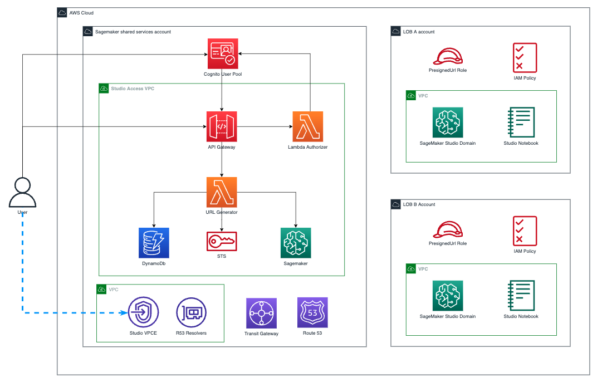
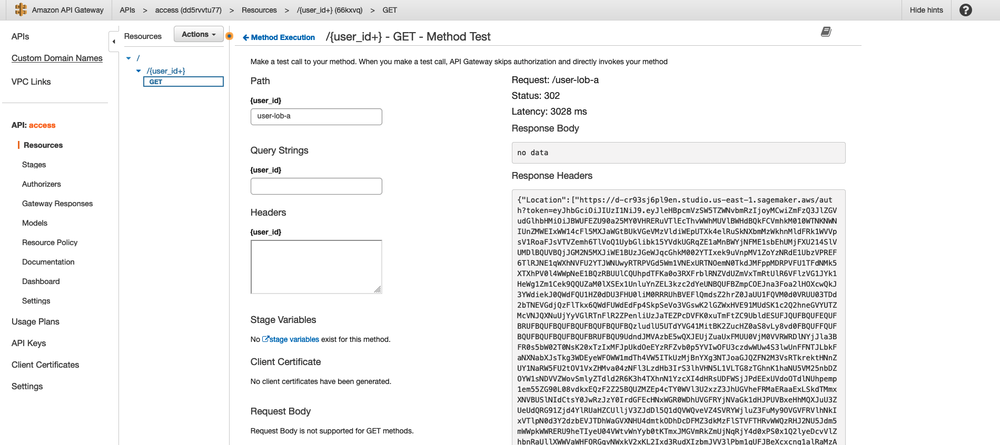
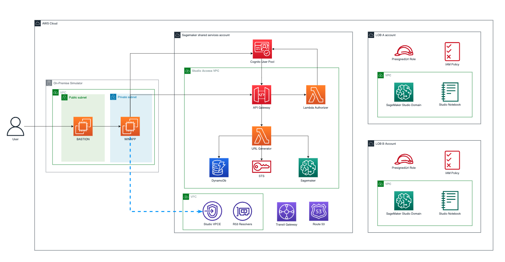
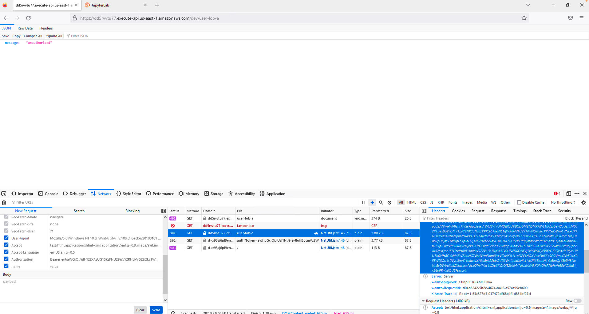

# MultiAccount Sagemaker Studio Private Access

This repository demonstrates the solution presented in the following [blog](link to be provided after blog publication).

It shows how to create an accessing solution for Sagemaekr Studio Domains in a multi account environment in a private and secure way by using presigned domain urls.



## Requirements
- [AWS CLI](https://docs.aws.amazon.com/cli/latest/userguide/getting-started-install.html) to run the commands
- [SAM CLI](https://docs.aws.amazon.com/serverless-application-model/latest/developerguide/install-sam-cli.html) installed
- 3 Accounts and a profile in the accounts for deployments:
    - Networking and Access resources -> Shared Services Account
    - Sagemaker Account A
    - Sagemaker Account B

[Setting up named profiles for AWS CLI](https://docs.aws.amazon.com/cli/latest/userguide/cli-configure-profiles.html)

## Deployment steps

The following parameters can be configured in the general paramters file (scripts/setup/parameters/general-parameters.json):

|       Parameter Name         |            Default Vale            |                      Description                                |
|           :----:             |              :----:                |                         :----:                                  |
|    pSharedServicesProfile    |    infra-shared-services-profile   | Profile used to deploy resources in the Shared Services Account |
|    pSagemakerLobAProfile     |    infra-lob-a-profile             | Profile used to deploy resources in the Sagemaker Lob A Account |
|    pSagemakerLobBProfile     |    infra-lob-b-profile             | Profile used to deploy resources in the Sagemaker Lob B Account |
|    region                    |    us-east-1                       | Region where resources are deployed                             |
|    pNetworkingStackName      |    networking                      | Name for the networking resources cfn stack                     |
|    pAccessAppStackName       |    access                          | Name for the access app resources cfn stack                     |
|    pSagemakerLobAStackName   |    sagemaker-lob-a                 | Name for the LOB A cfn stack                                    |
|    pSagemakerLobBStackName   |    sagemaker-lob-b                 | Name for the LOB B resources cfn stack                          |
|    pOnPremiseStackName       |    on-premise                      | Name for the on-premise resource cfn-stack                      |
|    pKeyPairName              |    sagemaker-demo-kp               | Name of the key pair for the on-premise deployment              |
|    pLocalIpAddress           |    1.1.1.1/32                      | Ip address to access the on-premise resources                   |

### Set the variables for the file location
```
DIRNAME=$(pwd)
GENERAL_PARAMS_FILE="${DIRNAME}/scripts/setup/parameters/general-parameters.json"
```

### Deploy shared services resources

From root of the repository. To deploy the shared service account resources run the following command:

```
./scripts/setup/deploy_infra.sh -c all

```

This will deploy 2 cloudformation stacks in your shared services account:
- Networking cloudformation stack
- Access cloudformation stack

#### Networking stack

Deploys the following resources that are reused by other templates:
- AWS Transit gateway (TGW)
- AWS VPC Endpoints
    - API Gateway VPC Endpoint
    - Sagemaker API VPC Endpoint Id
    - Sagemaker Studio VPC Endpoint Id
    - STS VPC Endpoint
- AWS Private Hosted Zones (PHZ)
    - Amazon API Gateway PHZ
    - Amazon Sagemaker API PHZ
    - Amazon Sagemaker Studio PHZ
    - STS PHZ
- A Transit Gateway Resource Share with Sagemaker Accounts

**Note**
Transit gateway is automatically shared with the Sagemaker accounts

If the account are in the same OU and auto accept resource shares is enabled there is no need to accept the resource. Otherwise, acceptance in the receiver accounts will be needed.

More informacion about this approach in [Automating AWS Transit Gateway attachments to a transit gateway in a central account](https://aws.amazon.com/blogs/networking-and-content-delivery/automating-aws-transit-gateway-attachments-to-a-transit-gateway-in-a-central-account/)

#### Access Application Stack

This template deploys: 
- Two AWS Lambda Functions for the solution:
    - Presigned URL generator Lambda function
    - Custom Authorizer Lambda function
- Two Amazon DynamoDB tables to store the information:
    - Users table
    - LOBs table
- An Amazon Cognito User Pool to simulate the corporate idp

---
**NOTE**

The following outputs from the deployment will later be used in other steps:
- The Amazon Cognito User Pool Id
- The Amazon Cognito App Client Id
- The ARN of the role for the Lambda Presigned Url generator function
- Name of the DynamoDB tables used for the users and lobs data

The script also associates the Access Stack Vpc with the STS and Sagemaker API Hosted Zones

## Deploy Sagemaker Accounts


### Account LOB A

Set up the following variables to deploy the Sagemaker LOB A deployment:

```
SAGEMAKER_LOB_A_STACK_NAME=$(jq -r '.[] | select(.ParameterKey == "pSagemakerLobAStackName") | .ParameterValue' ${GENERAL_PARAMS_FILE})
REGION=$(jq -r '.[] | select(.ParameterKey == "region") | .ParameterValue' ${GENERAL_PARAMS_FILE})
SAGEMAKER_LOB_A_PROFILE=$(jq -r '.[] | select(.ParameterKey == "pSagemakerLobAProfile") | .ParameterValue' ${GENERAL_PARAMS_FILE})
SAGEMAKER_LOB_A_PARAMS_FILE=sagemaker-account/blog-launch-parameters/parameters-sagemaker-account-lob-a.json
SAGEMAKER_LOB_A_TEMPLATE_FILE=file://sagemaker-account/template.yml
```
```
scripts/setup/deploy-sagemaker.sh \
    -f $SAGEMAKER_LOB_A_PARAMS_FILE \
    -s $SAGEMAKER_LOB_A_STACK_NAME \
    -p $SAGEMAKER_LOB_A_PROFILE \
    -t $SAGEMAKER_LOB_A_TEMPLATE_FILE\
    -r $REGION

```

### Account LOB B

Set up the following variables to deploy the Sagemaker LOB A deployment:

```
SAGEMAKER_LOB_B_STACK_NAME=$(jq -r '.[] | select(.ParameterKey == "pSagemakerLobBStackName") | .ParameterValue' ${GENERAL_PARAMS_FILE})
REGION=$(jq -r '.[] | select(.ParameterKey == "region") | .ParameterValue' ${GENERAL_PARAMS_FILE})
SAGEMAKER_LOB_B_PROFILE=$(jq -r '.[] | select(.ParameterKey == "pSagemakerLobBProfile") | .ParameterValue' ${GENERAL_PARAMS_FILE})
SAGEMAKER_LOB_B_PARAMS_FILE=sagemaker-account/blog-launch-parameters/parameters-sagemaker-account-lob-b.json
SAGEMAKER_LOB_B_TEMPLATE_FILE=file://sagemaker-account/template.yml
```
```
scripts/setup/deploy-sagemaker.sh \
    -f $SAGEMAKER_LOB_B_PARAMS_FILE \
    -s $SAGEMAKER_LOB_B_STACK_NAME \
    -p $SAGEMAKER_LOB_B_PROFILE \
    -t $SAGEMAKER_LOB_B_TEMPLATE_FILE\
    -r $REGION

```

This cloudformation templates create:
- An Amazon Virtual Private Cloud (VPC) for the Amazon Sagemaker Domain
- The Attachment of the VPC to the Shared Services Account TGW
- A private Amazon Sagemaker Domain with a user

## Filling the users and LOB Data

Now we will fill the users data in both the DyanmoDB Tables and the Cognito User Pool Id

Run the following script:
```
./scripts/setup/fill-data.sh

```

This scripts populates the following elements:

- Dynamo DB Users Table

|     PK      |     LOB     |
|   :----:    |    :----:   |
| user-lob-a  | lob-a       |
| Paragraph   | Text        |

- Dynamo DB LOBs Table

|     LOB     |            ACCOUNT_ID             |
|   :----:    |              :----:               |
|    lob-a    |    $SAGEMAKER_LOB_A_ACCOUNT_ID    |
|    lob-b    |    $SAGEMAKER_LOB_B_ACCOUNT_ID    |

- Cognito User Pool


|     User    |     Password     |
|    :----:   |      :----:      |
|  user-lob-a |    UserLobA1!    |
|  user-lob-b |    UserLobB1!    |


As you may notice the user names must be consistent accross the three resources:
- The Dynamo Db Users Table
- The Cognito Users Pool
- The Sagemaker Domain

### Testing the PresignedUrl

If we just want to test the presigned url this can easily be done following this steps:

- Go into the [API Gateway console](https://us-east-1.console.aws.amazon.com/apigateway/main/apis?region=us-east-1)
- Under APIs, find and click on the access API
- Under resources go to the access api {user_id+} get method
- Then click on test
- Enter one of `lob-user-a` or `lob-user-b` as the user_id path
- Click on the test button
- Copy the presigned url returned in the response
- Consume it in our simulated on-premise windows app



This presigned url must be consumed through the central Studio VPC Endpoint and will expire in 20 seconds, as defined in the Access Lambda function.

If we try to consume it through our browser a message saying: "Auth token containing insufficient permissions" will be shown.

# Extra:

## On premise deployment



For simplicity we will deploy the on premise simulator in the Central Account

First, create a key-pair in the central account. You can use the instructions in [Create key pairs](https://docs.aws.amazon.com/AWSEC2/latest/UserGuide/create-key-pairs.html)

Fill the following values in the general-parameters.json file (scripts/setup/parameters/general-parameters.json)
- YOUR_KEY_PAIR_NAME -> name of the key pair you created before
- YOUR_IP_TO_CONNECT_TO_BASTION -> the ip of your local machine ending in /32 

The run the following script to set up the on-premise stack:

```
./scripts/setup/deploy-on-premise.sh

```

The following script:
- Creates the on-premise CloudFormation Stack
- Associates the Sagemaker Studio and Api Gateway PHZ with the on-premise VPC

### On-premise connectivity

To simulate the connectivity of the on-premise environment and the cloud we will use VPC Peering between the On-premise VPC and the Central Networking VPC. [Intructions to create VPC Peering](https://docs.aws.amazon.com/vpc/latest/peering/create-vpc-peering-connection.html)

**Don´t forget to accept the peering connection**

Remember to update the route tables of on-prem and central networking private subnet route tables to point the respective CIDRs to the peering connection.

Once both VPCs have been peered we can use the solution for DNS proposed in [Part 1](https://aws.amazon.com/blogs/machine-learning/secure-amazon-sagemaker-studio-presigned-urls-part-1-foundational-infrastructure/) of this series. However, in this case we have taken advantage of the previously created PHZs and associate the Sageamker Studio and API Gateway PHZs with our On-premise VPC, as we did for the Access VPC.

## Testing the solution

Once deploy and set up we have to use the bastion host to RDP into the instance in the private subnet

The following command can be used to retrieve the command that must be launched:

```
ON_PREMISE_STACK_NAME=$(jq -r '.[] | select(.ParameterKey == "pOnPremiseStackName") | .ParameterValue' scripts/setup/parameters/general-parameters.json)
REGION=$(jq -r '.[] | select(.ParameterKey == "region") | .ParameterValue' ${GENERAL_PARAMS_FILE})
SHARED_SERVICES_PROFILE=$(jq -r '.[] | select(.ParameterKey == "pSharedServicesProfile") | .ParameterValue' ${GENERAL_PARAMS_FILE})

aws --profile ${SHARED_SERVICES_PROFILE} --region ${REGION} cloudformation describe-stacks --query "Stacks[?StackName=='${ON_PREMISE_STACK_NAME}'][].Outputs[?OutputKey=='TunnelCommand'].OutputValue" --output text

```

In a terminal and with the previously created ec2 key pair run the command

This will create an RDP connection between our localhost and the private windows instance.

And then use an rdp client like Windows Remote Desktop to connect to the instance.
- Username: Administrator
- Password: Can be retrieved with the KeyPair from the Windows instance

More information about connecting to your windows instance in AWS documentation [Connect To Your Windows Instance](https://docs.aws.amazon.com/AWSEC2/latest/WindowsGuide/connecting_to_windows_instance.html) official documentation

Once in the instance (if it is not installed) we will install firefox -> [Link to install firefox in the instance](https://gmusumeci.medium.com/unattended-install-of-firefox-browser-using-powershell-6841a7742f9a)

### Testing End to End

To test the end to end we will need to get tokens for the users, so that we can consume the access API.

To get the access tokens run the following commands substuting the cognito client id which can be retrieved from the access stack:

```
REGION=$(jq -r '.[] | select(.ParameterKey == "region") | .ParameterValue' ${GENERAL_PARAMS_FILE})
SHARED_SERVICES_PROFILE=$(jq -r '.[] | select(.ParameterKey == "pSharedServicesProfile") | .ParameterValue' ${GENERAL_PARAMS_FILE})
ACCESS_STACK_NAME=$(jq -r '.[] | select(.ParameterKey == "pAccessAppStackName") | .ParameterValue' scripts/setup/parameters/general-parameters.json)

COGNITO_APP_CLIENT_ID=$(aws --profile ${SHARED_SERVICES_PROFILE} --region ${REGION} cloudformation describe-stacks --query "Stacks[?StackName=='${ACCESS_STACK_NAME}'][].Outputs[?OutputKey=='CognitoAppClientId'].OutputValue" --output text)
```

```
aws cognito-idp initiate-auth \
    --profile $SHARED_SERVICES_PROFILE \
    --region $REGION \
    --auth-flow USER_PASSWORD_AUTH \
    --client-id $COGNITO_APP_CLIENT_ID \
    --auth-parameters USERNAME=user-lob-a,PASSWORD=UserLobA1!
```
```
aws cognito-idp initiate-auth \
    --profile $SHARED_SERVICES_PROFILE \
    --region $REGION \
    --auth-flow USER_PASSWORD_AUTH \
    --client-id $COGNITO_APP_CLIENT_ID \
    --auth-parameters USERNAME=user-lob-b,PASSWORD=UserLobB1!
```

Now to test we need the API´s URL which we retrieved from the access-stack outputs and we can get it by running this command:

```
echo $(aws --profile ${SHARED_SERVICES_PROFILE} --region ${REGION} cloudformation describe-stacks --query "Stacks[?StackName=='${ACCESS_STACK_NAME}'][].Outputs[?OutputKey=='ApiBasePath'].OutputValue" --output text)

```

To call for user a the api call will look as follows:

https://{API_ID}.execute-api.{REGION}.amazonaws.com/dev/user-lob-a

Once we have all this information, we can try to call the API Gateway api from within our windows app, however we should get the following error: {message: Unauthorize}

Therefore we will add the tokens to the request header.

1. Got to Firefox inspection tools and network tab
2. Right click on the failed API with File as user-lob-a call and click Edit and Resend
3. Scroll down on the headers side and add a new header

- Header Key: Authorization
- Header Value: Bearer <access-token-of-user-to-make-request>

And click send



In the return response you will get the Location and if you click on it it will open up your Jupyter Lab

Click it fast as you only get 20 seconds to consume it

First time it will take some time, as Sagemaker is creating the application for the user, but next attemps will be faster.

In a real world scenario this action will be perform by an access application which will authomatically understand the 302 redirect and send the user to the Sagemaker App

If we try to edit the request to send all the same information but for the user-lob-b URL we will get the following error in the response:

x-amzn-ErrorType: AccessDeniedException

This same process could be repeated changing eveything of user-lob-a to user-lob-b and the access would be granted for the LOB B domain

## Clean up

1. [Delete the VPC Peering Connection](https://docs.aws.amazon.com/vpc/latest/peering/delete-vpc-peering-connection.html)
2. Remove the associated VPCs from the PHZs. You can use the following command

```
scripts/cleanup/remove-associated-vpcs.sh

```

3. Delete the EFS Volumes for the Sagemaker Domains. See [Deleting an Amazon EFS file system](https://docs.aws.amazon.com/efs/latest/ug/delete-efs-fs.html)
4. Delete any opened applications from the Sagemaker Domains as explained in [Delete an Amazon Sagemaker Domain](https://docs.aws.amazon.com/sagemaker/latest/dg/gs-studio-delete-domain.html)
5. Run the clean up script.

```
scripts/cleanup/delete-infra.sh
```

The script search for the CloudFormation stacks in their respective accounts and deletes them, the orders is the following:
- On-Premise Stack
- Sagemaker LOB A Stack
- Sagemaker LOB B Stack
- Access App Stack
- Networking Stack

## Security

See [CONTRIBUTING](CONTRIBUTING.md#security-issue-notifications) for more information.

## License

This library is licensed under the MIT-0 License. See the LICENSE file.

